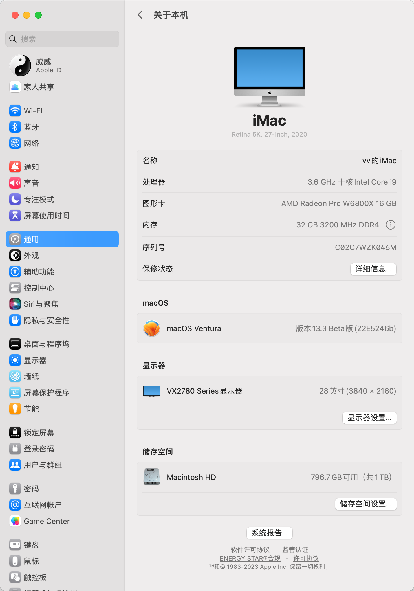

# Hackintosh - AsRock Z490 Phantom Gaming ITX/TB3 - intel Core 10850k - OpenCorePkg

Hackintosh - AsRock Z490 Phantom Gaming ITX/TB3 - intel Core 10850k - OpenCorePkg

## 电脑配置
|规格 | 详细信息|
|:-: | :-:|
|主板| AsRock Z490 Phantom Gaming ITX/TB3 |
|操作系统| **macOS** Big Sur 11.2.2|
|处理器| Intel Core 10850k |
|内存| G.SKILL 皇家戟 DDR4 16G×2 3200Mhz |
|硬盘| WD_BLACK SN750 1TB x 2 |
|显卡| Intel UHD Graphics 630 / Sapphire RX 560 |
|显示器| ViewSonic VX2780 Series 4K |
|声卡| Realtek ALC1220 |
|网卡| ~~Intel AX201NGW~~ 更换为 DW 1820A |
|SMBIOS| iMac20,2 |

## 使用说明

### BISO设置

 - **BIOS**版本：**v1.50**
 
   - **Adanced** \ **Chipset Configuration**-> **Above 4G Decoding**:**Enabled**
  
   - **Adanced** \ **Chipset Configuration**-> **VT-d**:**Disabled**
  
   - **Adanced** \ **UChipset Configuration**-> **Share Memory**:**128MB**
  
   - **Adanced** \ **UChipset Configuration**-> **IGPU Multi-Monitor**:**Enabled**
  
   - **Adanced** \ **Intel(R) Thunderboit**-> **Discrete Thunderboit(TM) Support**:**Enabled**  
  
   - **Adanced** \ **Intel(R) Thunderboit**-> **Thunderboit Boot Support**:**Disabled**  
  
   - **Adanced** \ **Intel(R) Thunderboit**-> **Thunderboit USB Support**:**Disabled**  
  
   - **Adanced** \ **Intel(R) Thunderboit**-> **Titan Ridge Workaround for OSUP**:**Disabled**  
  
   - **Adanced** \ **Intel(R) Thunderboit**-> **Security Level**:**NO Security**  
  
   - **Adanced** \ **USB Configuration**-> **XHCI Hand-off**:**Enabled**
   
   - **Adanced** \ **USB Configuration**-> **Legacy USB Support**:**UEFI Setup Only**
  
   - **Boot** \ **CSM(Compatibility Support Module)**-> **CSM**:**Disabled**
  

### SMBIOS

- 默认 **iMac20,2**

  - 使用其它机型**SMBIOS**时请修改**USBPorts.kext**-**Contents**-**Info.plist**
  
  

### 正常工作

- [x] **USB**已通过**USBPorts.kext**定制全部**USB**端口，无需重复定制。
- [x] **Wi-Fi**和**Bluetooth**(通过**DW 1820A**无线卡)
- [x] 声卡**Realtek ALC1220**(`layout-id = 28`)
- [x] 网卡**Realtek RTL8125BG**
- [x] **Thunderbolt 3**支持热拔插(**雷雳/USB4载入驱动程序**需要刷固件)
- [x] 睡眠

### 其它设置

### 感谢

- [`Acidanther`](https://github.com/acidanthera)项目

- [`SchmockLord`](https://github.com/SchmockLord/Hackintosh-Intel-i9-10900k-AsRock-Z490-Phantom-ITX-TB3)

- @哞

    ......

