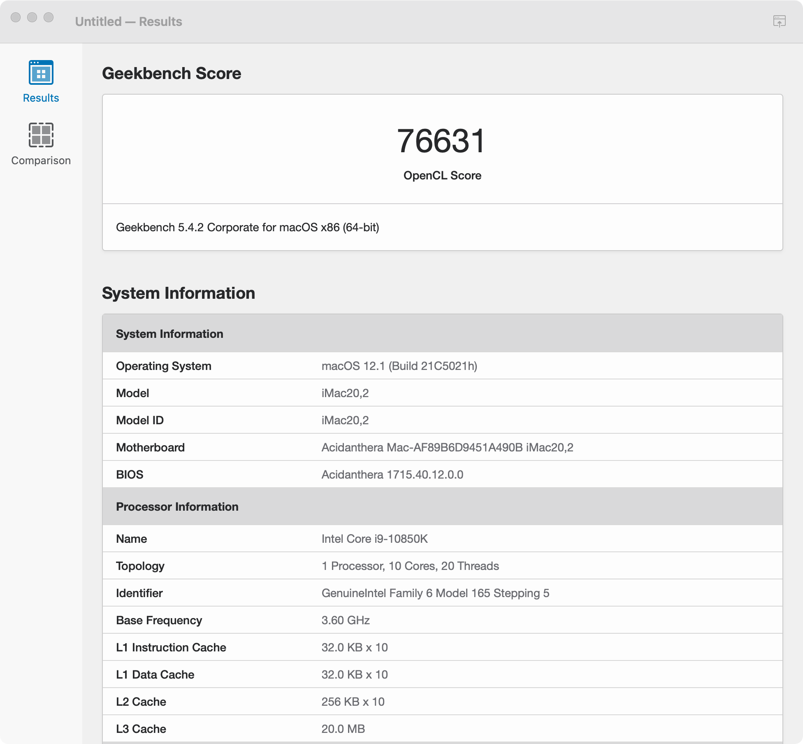

# Hackintosh - AsRock Z490 Phantom Gaming ITX/TB3 - intel Core 10850k - OpenCorePkg


Hackintosh - AsRock Z490 Phantom Gaming ITX/TB3 - intel Core 10850k - OpenCorePkg

## 电脑配置
|规格 | 详细信息|
|:-: | :-:|
|主板| AsRock Z490 Phantom Gaming ITX/TB3 |
|操作系统| **macOS** Ventura 13.0 Beta版(22A5352e) |
|处理器| Intel Core 10850k / 10500 |
|内存| G.SKILL 皇家戟 DDR4 16G×2 3200Mhz （OC 3800Mhz C18-22-22-42）|
|硬盘| WD_BLACK SN750 1TB x 2 / WD_BLACK 黑盘 1TB SATA6Gb/s 7200转64M x 1 |
|显卡| Intel UHD Graphics 630 / Sapphire RX 6600XT |
|显示器| ViewSonic VX2780 Series 4K |
|声卡| Realtek ALC1220 |
|网卡| ~~Intel AX201NGW~~ 更换为 BCM943602CS |
|SMBIOS| iMac20,2 |


## 使用说明

### BISO设置

 - **BIOS**版本：**v1.60**
 
   - **Adanced** \ **Chipset Configuration**-> **Above 4G Decoding**:**Enabled**
  
   - **Adanced** \ **Chipset Configuration**-> **VT-d**:**Disabled**
  
   - **Adanced** \ **UChipset Configuration**-> **Share Memory**:**128MB**
  
   - **Adanced** \ **UChipset Configuration**-> **IGPU Multi-Monitor**:**Enabled**
  
   - **Adanced** \ **Intel(R) Thunderboit**-> **Discrete Thunderboit(TM) Support**:**Enabled**  
  
   - **Adanced** \ **Intel(R) Thunderboit**-> **Thunderboit Boot Support**:**Disabled**  
  
   - **Adanced** \ **Intel(R) Thunderboit**-> **Thunderboit USB Support**:**Disabled**  
  
   - **Adanced** \ **Intel(R) Thunderboit**-> **Titan Ridge Workaround for OSUP**:**Disabled**  
  
   - **Adanced** \ **Intel(R) Thunderboit**-> **Security Level**:**NO Security**  
  
   - **Adanced** \ **USB Configuration**-> **XHCI Hand-off**:**Enabled**
   
   - **Adanced** \ **USB Configuration**-> **Legacy USB Support**:**UEFI Setup Only**
  
   - **Boot** \ **CSM(Compatibility Support Module)**-> **CSM**:**Disabled**
   
   - **Adanced** \ **ACPI Configuration**-> **Suspend to RAM**:**Auto**  
   
   - **Adanced** \ **ACPI Configuration**-> **PS/2 Keyboard S4/S5 Wakeup Support**:**Any Key**  
   
   - **Adanced** \ **ACPI Configuration**-> **USB Keyboard/Remote Power On**:**Disabled**  
  
   - **Adanced** \ **ACPI Configuration**-> **USB Mouse Power On**:**Disabled**  

  
### 正常工作

- [x] **Wi-Fi**和**Bluetooth**(通过**BCM943602CS**无线卡)支持隔空、接力、随航、个人热点
- [x] 声卡**Realtek ALC1220**(**layout-id=28 or 29**)
- [x] 网卡**Realtek RTL8125BG**
- [x] **Thunderbolt 3**支持热拔插（未加载**Thunderbolt 3**总线也可以正常使用）
- [x] 睡眠（支持USB唤醒）

### **Ventura** 下不正常工作的

- [x] 第三方无线网卡 DW1560，DW1820a、英特尔系列（白果拆机卡正常）

### USB端口

- [x] **USB**已通过**SSDT-UIAC.aml**定制全部**USB**端口，更换SMBIOS时无需其它设置。不需要的USB端口使用**Hackintool**删除后导出**SSDT-UIAC.aml**替换即可。

<details>
<summary><strong>EFI 文件内容</strong></summary>

### EFI 文件内容

```
EFI
├── BOOT
│   └── BOOTx64.efi
└── OC
    ├── ACPI
    │   ├── SSDT-OC-Merge.aml
    │   ├── SSDT-UIAC.aml
    │   ├── SSDT-DTGP.aml
    │   ├── SSDT-TB3HP.aml
    │   ├── SSDT-AMD Radeon Pro W5500X.aml
    │   └── SSDT-AMD Radeon Pro W6600X.aml
    ├── Drivers
    │   ├── HfsPlus.efi
    │   ├── OpenCanopy.efi
    │   ├── OpenHfsPlus.efi
    │   └── OpenRuntime.efi
    ├── Kexts
    │   ├── AGPMInjector.kext
    │   ├── AirportBrcmFixup.kext
    │   │   └── Contents
    │   │       └── PlugIns
    │   │           ├── AirPortBrcm4360_Injector.kext 
    │   │           ├── AirPortBrcmNIC_Injector.kext 
    │   │           ├── BlueToolFixup.kext
    │   │           ├── BrcmBluetoothInjector.kext
    │   │           ├── BrcmFirmwareData.kext
    │   │           └── BrcmPatchRAM3.kext
    │   ├── AppleALC.kext
    │   ├── Lilu.kext
    │   ├── LucyRTL8125Ethernet.kext
    │   ├── RadeonSensor.kext
    │   │   └── Contents
    │   │       └── PlugIns
    │   │           └── SMCRadeonGPU.kext    
    │   ├── SMCProcessor.kext
    │   ├── SMCSuperIO.kext
    │   ├── USBInjectAll.kext
    │   ├── USBWakeFixup.kext
    │   ├── VirtualSMC.kext
    │   └── WhateverGreen.kext
    ├── OpenCore.efi
    ├── Resources 
    │   ├── Audio
    │   ├── Font
    │   ├── Image
    │   └── Label
    ├── config.plist
    └── config-IGPU.plist
```
</details>
<details>
<summary><strong>其它设置</strong></summary>

### 其它设置


 
### AMD Radeon显卡温度工具**RadeonSensor**
 
 - [`RadeonSensor说明`](https://github.com/aluveitie/RadeonSensor)
 
### 显卡性能提升


- **SSDT-AMD Radeon Pro W5500X.aml**AMD Radeon RX5500XT性能增强SSDT，相同显卡可开启

   -  此**ssdt**使用**MorePowerTool**将**GPU**超频至**2100M**、**显存**超频至**1800M**、解**功耗墙**至**250瓦**、**电压1270mv**
   
- **请使用GPU-Z**查看显卡的**The board ID**并替换SSDT中的**ATY,Rom#** **ATY,EFIVersionB**值

- 如果感觉到卡顿，修改**SSDT-AMD Radeon Pro W5500X.aml**里有**ATY,Python**的值，把**Python**替换为**Boa**, 5500 XT 基本就是这两个值

- AMD NAVI 核心显卡 PP_PhmSoftPowerPlayTable 参数
   - [`获取PP_PhmSoftPowerPlayTable参数生成方式`](https://github.com/huijiewei/ASRock-Z390m-ITX-ac-Opencore/blob/master/Resources/5500XT/README.md)
 
   -  将获得的原始数据贴进**Hex Fiend.app**工具然后直接保存成文件。使用终端运行ResourceConverter.sh -a +文件路径就完事（借着ResourceConverter 把十六进制转成 ASL Buffer）
   
  

 - 显卡性能提升也可以使用**DeviceProperties**注入 
 
### Sapphire Radeon RX 6600XT
- **SSDT-AMD Radeon Pro W6600X.aml **AMD Radeon RX 6600XT性能增强SSDT（需要配合**AGPMInjector.kext**一起使用），相同显卡可开启

   -  此**ssdt**使用**MorePowerTool** **显存**超频至**2250M**、解**功耗墙**至**250瓦**
   -  **AGPMInjector.kext**在使用其它机型**SMBIOS**时请修改**AGPMInjector.kext**-**Contents**-**Info.plist**
 
 
 
 
### 加载**Thunderbolt 3**总线

  
- 刷入**ASRock-itx_tb3-NVM50-E64Fr-CSJ-dgsga.bin**需要使用编程器（取下芯片才能刷入），建议去找电脑维修的专业人士进行操作。
 - 存储**Thunderbolt**固件芯片位置见下图，芯片型号为**MXIC MX 25L8006E**
  

- 存在问题：刷入**ASRock-itx_tb3-NVM50-E64Fr-CSJ-dgsga.bin**固件加载**Thunderbolt 3**总线后会导致**WIN10**下 **Thunderbolt 3**无法驱动！刷前请一定要备份！！！

</details>

### 感谢

- [`Acidanther`](https://github.com/acidanthera) 项目

- [`SchmockLord`](https://github.com/SchmockLord/Hackintosh-Intel-i9-10900k-AsRock-Z490-Phantom-ITX-TB3)

- @哞

    ......

